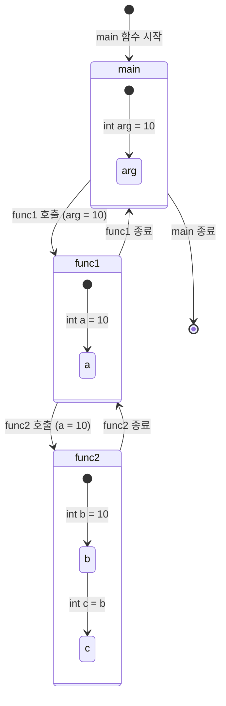

```mermaid
stateDiagram
    [*] --> main: main 함수 시작
    state main {
        [*] --> arg: int arg = 10
    }
    main --> func1: func1 호출 (arg = 10)
    state func1 {
        [*] --> a: int a = 10
    }
    func1 --> func2: func2 호출 (a = 10)
    state func2 {
        [*] --> b: int b = 10
        b --> c: int c = b
    }
    func2 --> func1: func2 종료
    func1 --> main: func1 종료
    main --> [*]: main 종료
```
